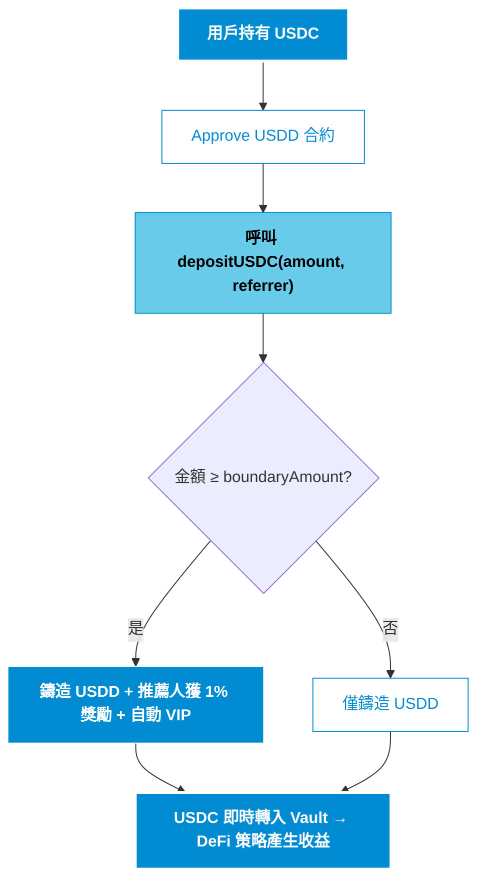
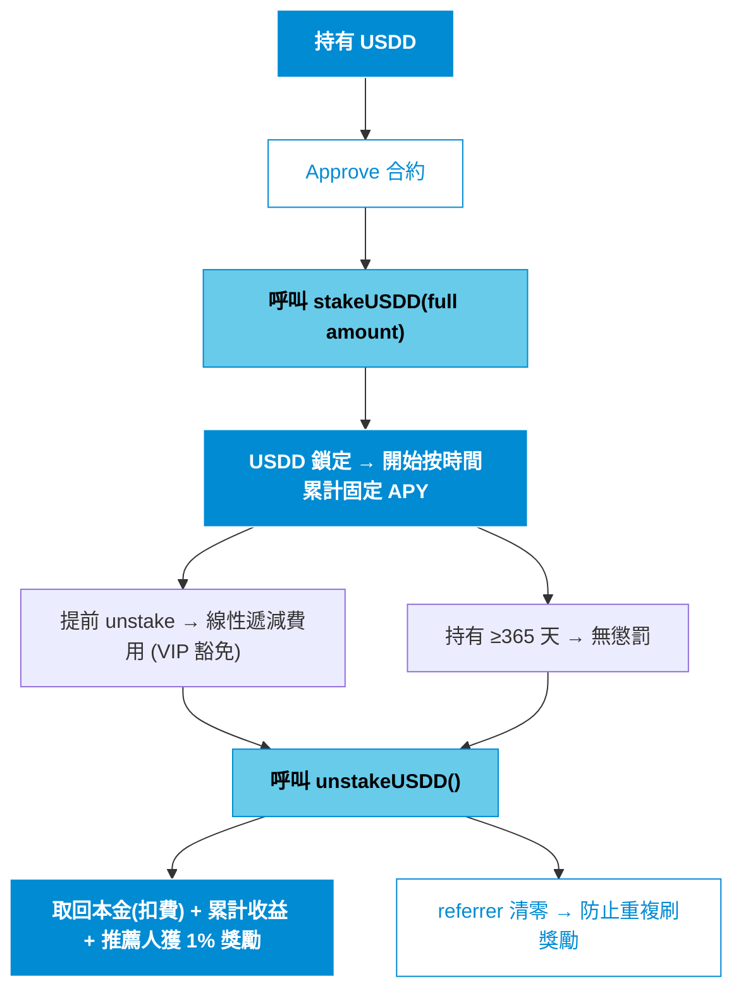

# USDD by Pantha Capital  
**The Premier Yield-Bearing RWA Stablecoin on Base Chain**  
Bridging Institutional-Grade Real-World Yield with On-Chain Accessibility  

#
## 🔵 Executive Summary  
USDD 是 Pantha Capital 推出的機構級收益型穩定幣（yield-bearing stablecoin），專注於將現實世界資產（RWA）代幣化並部署於低風險 DeFi 策略中，為用戶提供穩定、可預測的固定 APY 收益。  

部署於 **Base 鏈**（2025 年 TVL 已突破 $10B，增長勢頭領先所有 L2），USDD 結合 1:1 USDC 錨定、手動贖回機制、擴散式推薦獎勵以及嚴格的資本效率設計，定位為下一代 RWA 基礎設施的核心組成部分。  

 **市場機會**：  
- 2025 年 RWA 代幣化市場規模已達 $30B+，較年初增長超過 260%。  
- 機構預測顯示，至 2030 年市場將擴張至 $10–30 萬億美元（McKinsey、Boston Consulting Group 等共識）。  
- Yield-bearing stablecoin 類別 2025 年總市值已達 $15B，年增長 300%，正成為機構資金進入 DeFi 的首選橋樑。  

Pantha Capital 將 vault 資金主要配置於 Uniswap V3 & V4 集中流動性穩定幣池及其他精選低風險策略，優先資本保全並產生持續收益。這些鏈下收益直接支持協議的固定 APY 分發與贖回流動性，實現 TradFi 等級的穩定性與 DeFi 的透明可組合性。

#
## 🔵 Core Product Features

- **資本效率優先** — 全額單筆質押確保 APY 計算精準公平  
- **擴散式增長引擎** — 1% 推薦獎勵 + 自動 VIP 授權，驅動生態指數級擴張  
- **風險控管** — 小額懲罰機制引導資金規模化；unstake 後 referrer 清零防止刷獎勵  
- **手動贖回** — 由多位 operation manager 履行，確保策略靈活性與資金安全 

#
## 🔵 User Journey Flowcharts  

#
## 🔵 Governance & Operations  

- **Owner 權限**：調整 APY / 費用 / boundary / vault / VIP / manager  
- **多經理贖回**：分散履行責任，提升機構級可靠性  
- **資產提取限制**：禁止提取 USDD，確保協議完整性  

#
## 🔵 Risk Disclosure (Transparency First) 

- 高信任依賴：贖回依賴團隊履行，vault 資金由 Pantha Capital 管理  
- 通脹機制：收益與推薦獎勵透過鑄造實現（已設防刷機制）  
- 市場風險：鏈下策略收益波動可能影響 APY 持續性  
- 建議僅投入可承受範圍內資金，並關注 vault 透明度報告  

#
## 🔵 Contract Addresses (Base Chain)  
- **USDD Token**：`[Post-deployment]`  
- **USDC**：`0x833589fCD6eDb6E08f4c7C32D4f71b54bdA02913`  

#
## 🔵 Security & Audits  
- 基於 OpenZeppelin 最新標準庫  
- 全關鍵函數 nonReentrant 保護  
- Custom errors + immutable 優化  
- 持續靜態分析與 gas 優化  

#
## 🔵 Contact  
Security & Business Inquiries: hopeallgood.unadvised619@passinbox.com  

