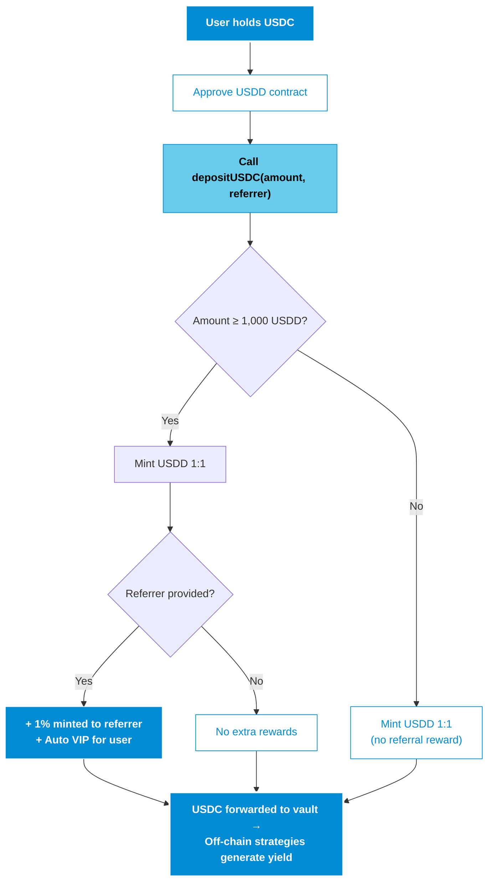
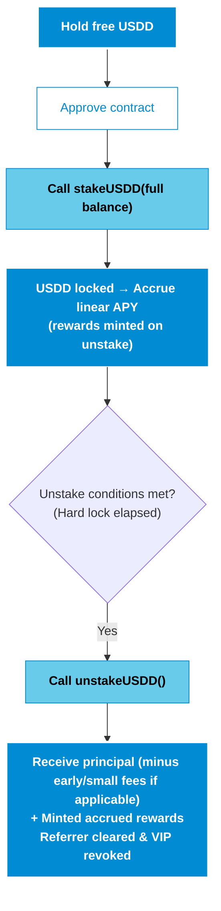

# USDD by Pantha Capital
**The Premier Yield-Bearing RWA Stablecoin on Base Chain**
Bridging Institutional-Grade Real-World Yield with On-Chain Accessibility

#
## 🔵 Executive Summary
USDD is an institutional-grade yield-bearing stablecoin launched by Pantha Capital. It tokenizes real-world assets (RWA) and deploys them in low-risk DeFi strategies to deliver stable, predictable fixed APY yields to holders.

Deployed on the Base chain—a leading L2 solution with continued strong growth into 2026—USDD offers 1:1 USDC backing, manual redemption, viral referral incentives, and mechanisms that strongly encourage large, long-term positions.

**Market Opportunity (as of early 2026):**
- The RWA tokenization sector (excluding fiat stablecoins) has surpassed $35 billion, with over 200% cumulative growth since early 2025.
- Institutional forecasts continue to project expansion to $10–30 trillion by 2030 (McKinsey, Boston Consulting Group, World Economic Forum, etc.).
- The yield-bearing stablecoin category maintains a total market cap exceeding $15 billion, with sustained triple-digit annual growth, establishing itself as a key on-ramp for institutional capital into DeFi.

Pantha Capital allocates vault funds primarily to Uniswap V3/V4 concentrated liquidity stablecoin pools and select low-risk venues, prioritizing capital preservation and consistent yield. Off-chain yields fund on-chain APY rewards (via minting) and ensure liquidity for manual redemptions, delivering TradFi-grade stability with full on-chain transparency.

#
## 🔵 Core Product Features
- **Capital Efficiency Focus** — Full-amount single-stake model for simple, fair, time-proportional APY accrual
- **Viral Growth Engine** — 1% referral reward on large deposits (≥ 1,000 USDD) + automatic VIP status when using a referrer
- **Anti-Abuse Safeguards** — Referrer cleared and VIP revoked on unstake to prevent reward farming; punitive fees strongly discourage small positions and early exits (non-VIP)
- **Flexible Operations** — Manual redemption fulfilled by owner or multiple operation managers; configurable hard lock period for new stakes
- **Predictable Yield** — Linear fixed APY (currently 12.00%, owner-adjustable) with rewards minted on unstake

#
## 🔵 User Journey Flowcharts

### Deposit & Referral Flow

```mermaid
flowchart TD
    classDef primary fill:#018BD3,stroke:#fff,color:#fff,font-weight:bold;
    classDef secondary fill:#68CBEA,stroke:#018BD3,color:#000,font-weight:bold;
    classDef action fill:#fff,stroke:#018BD3,color:#018BD3;
    A["User holds USDC"]:::primary --> B["Approve USDD contract"]:::action
    B --> C["Call depositUSDC(amount, referrer)"]:::secondary
    C --> D{"Amount ≥ 1,000 USDD?"}
    D -->|Yes| E["Mint USDD 1:1"]
    E --> F{"Referrer provided?"}
    F -->|Yes| G["+ 1% minted to referrer<br>+ Auto VIP for user"]:::primary
    F -->|No| H["No extra rewards"]:::action
    D -->|No| I["Mint USDD 1:1<br>(no referral reward)"]:::action
    G --> J["USDC forwarded to vault →<br>Off-chain strategies generate yield"]:::primary
    H --> J
    I --> J
    style A stroke-width:3px
    style J stroke-width:3px
```
### Staking & Unstaking Flow

```mermaid
flowchart TD
    classDef primary fill:#018BD3,stroke:#fff,color:#fff,font-weight:bold;
    classDef secondary fill:#68CBEA,stroke:#018BD3,color:#000,font-weight:bold;
    classDef action fill:#fff,stroke:#018BD3,color:#018BD3;
    K["Hold free USDD"]:::primary --> L["Approve contract"]:::action
    L --> M["Call stakeUSDD(full balance)"]:::secondary
    M --> N["USDD locked → Accrue linear APY<br>(rewards minted on unstake)"]:::primary
    N --> O{"Unstake conditions met?<br>(Hard lock elapsed)"} 
    O -->|Yes| P["Call unstakeUSDD()"]:::secondary
    P --> Q["Receive principal (minus early/small fees if applicable)<br>+ Minted accrued rewards<br>Referrer cleared & VIP revoked"]:::primary
    style K stroke-width:3px
    style Q stroke-width:3px
```
### Staking & Unstaking Flow

```mermaid
flowchart TD
    classDef primary fill:#018BD3,stroke:#fff,color:#fff,font-weight:bold;
    classDef secondary fill:#68CBEA,stroke:#018BD3,color:#000,font-weight:bold;
    classDef action fill:#fff,stroke:#018BD3,color:#018BD3;
    K["Hold free USDD"]:::primary --> L["Approve contract"]:::action
    L --> M["Call stakeUSDD(full balance)"]:::secondary
    M --> N["USDD locked → Accrue linear APY<br>(rewards minted on unstake)"]:::primary
    N --> O{"Unstake conditions met?<br>(Hard lock elapsed)"} 
    O -->|Yes| P["Call unstakeUSDD()"]:::secondary
    P --> Q["Receive principal (minus early/small fees if applicable)<br>+ Minted accrued rewards<br>Referrer cleared & VIP revoked"]:::primary
    style K stroke-width:3px
    style Q stroke-width:3px
```

## 🔵 Governance & Operations
- **Owner Controls** — Adjust APY, early unstake fee, referral rate, boundary threshold, vault address, VIP/manager status, min lock period
- **Multi-Manager Redemption** — Distributed fulfillment for reliability and security
- **Protected Integrity** — Cannot withdraw USDD from contract; external mint-and-stake limited to backed private allocations

## 🔵 Risk Disclosure (Transparency First)
- **Centralized Trust** — Redemption depends on team fulfillment; vault funds managed off-chain by Pantha Capital
- **Inflationary Rewards** — APY and referral rewards minted on-chain (backed by off-chain yield with anti-farming measures)
- **Yield Variability** — Underlying strategy performance may impact long-term APY sustainability
- **Punitive Mechanics** — Small positions (< 1,000 USDD) face high fees or restrictions to enforce capital consolidation
- **Recommendation** — Invest only what you can afford to risk; monitor protocol updates and vault reports

## 🔵 Contract Addresses (Base Chain)
- **USDD Token** — `[Post-deployment]`
- **USDC** — `0x833589fCD6eDb6E08f4c7C32D4f71b54bdA02913`

## 🔵 Security & Audits
- Built on latest OpenZeppelin libraries (ERC20, Ownable, ReentrancyGuard, SafeERC20)
- All external state changes protected by nonReentrant
- Custom errors, immutable constants, and gas optimizations
- Ongoing static analysis; professional audit recommended for production

## 🔵 Contact
Security & Business Inquiries: hopeallgood.unadvised619@passinbox.com
