# USDD by Pantha Capital  
**The Premier Yield-Bearing RWA Stablecoin on Base Chain**  
Bridging Institutional-Grade Real-World Yield with On-Chain Accessibility  

#
## 🔵 Executive Summary  
USDD is an institutional-grade yield-bearing stablecoin launched by Pantha Capital. It focuses on tokenizing real-world assets (RWA) and deploying them in low-risk DeFi strategies to provide users with stable and predictable fixed APY yields.
Deployed on the Base chain (which has shown strong growth momentum among L2 solutions in 2025), USDD combines 1:1 USDC pegging, manual redemption mechanisms, viral referral rewards, and strict capital efficiency design. It positions itself as a core component of next-generation RWA infrastructure.

Market Opportunity: 
- The RWA tokenization market has reached $30B+ in 2025, with over 260% growth from the beginning of the year.  
- Institutional forecasts indicate expansion to $10–30 trillion by 2030 (consensus from McKinsey, Boston Consulting Group, and others).  
- The yield-bearing stablecoin category has a total market cap of $15B in 2025, with 300% annual growth, becoming the preferred bridge for institutional funds entering DeFi.

Pantha Capital primarily allocates vault funds to Uniswap V3 & V4 concentrated liquidity stablecoin pools and other selected low-risk strategies. It prioritizes capital preservation while generating sustained yields. These yields directly support the protocol's fixed APY distribution and redemption liquidity, achieving TradFi-level stability alongside DeFi's transparency and composability.

#
## 🔵 Core Product Features

- **Capital Efficiency Priority** — Full single-deposit staking ensures precise and fair APY calculations  
- **Viral Growth Engine** — 1% referral rewards + automatic VIP authorization to drive exponential ecosystem expansion 
- **Risk Controls** — Minor penalty mechanisms guide large-scale funding; referrer cleared after unstake to prevent reward farming  
- **Manual Redemption** — Fulfilled by multiple operation managers for strategy flexibility and fund security 

#
## 🔵 User Journey Flowcharts  

```mermaid
flowchart TD
    classDef primary fill:#018BD3,stroke:#fff,color:#fff,font-weight:bold;
    classDef secondary fill:#68CBEA,stroke:#018BD3,color:#000,font-weight:bold;
    classDef action fill:#fff,stroke:#018BD3,color:#018BD3;

    H["Hold USDD"]:::primary --> I["Approve contract"]:::action
    I --> J["Call stakeUSDD(full amount)"]:::secondary
    J --> K["USDD locked → Start accruing fixed APY over time"]:::primary
    K --> L["Hold ≥365 days → No penalty"]
    K --> M["Early unstake → Linear decreasing fee (VIP exempt)"]
    M --> N["Call unstakeUSDD()"]:::secondary
    L --> N
    N --> O["Redeem principal (after fees) + Accrued yield + Referrer gets 1% reward"]:::primary
    N --> P["Referrer cleared → Prevent repeated reward farming"]:::action
```

#
## 🔵 Governance & Operations  

- **Owner Permissions:**：Adjust APY / fees / boundary / vault / VIP / manager    
- **Multi-Manager Redemption:**：Distribute fulfillment responsibilities for institutional-grade reliability  
- **Asset Withdrawal Restrictions:**：Prohibit USDD extraction to ensure protocol integrity  

#
## 🔵 Risk Disclosure (Transparency First) 

- **High trust dependency:** Redemption relies on team fulfillment; vault funds managed by Pantha Capital  
- **Inflation mechanism:** Yields and referral rewards realized through minting (with anti-farming safeguards)  
- **Market risk:** Fluctuations in underlying strategy yields may affect APY sustainability  
- **Recommendation:** Only invest funds you can afford to risk, and monitor vault transparency reports

#
## 🔵 Contract Addresses (Base Chain)  
- **USDD Token**：`[Post-deployment]`  
- **USDC**：`0x833589fCD6eDb6E08f4c7C32D4f71b54bdA02913`  

#
## 🔵 Security & Audits  
- Built on the latest OpenZeppelin standard libraries  
- All critical functions protected with nonReentrant  
- Custom errors + immutable optimizations  
- Ongoing static analysis and gas optimization

#
## 🔵 Contact  
Security & Business Inquiries: hopeallgood.unadvised619@passinbox.com  
